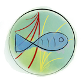
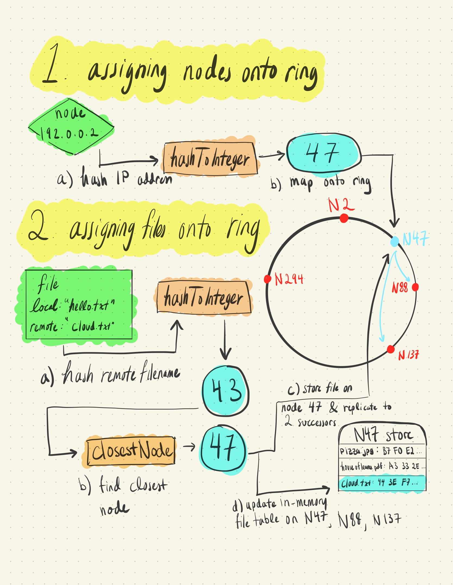
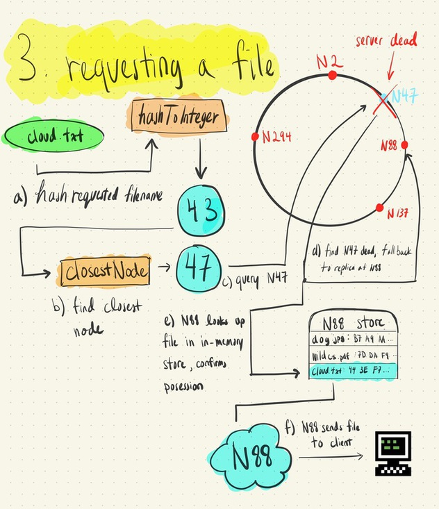
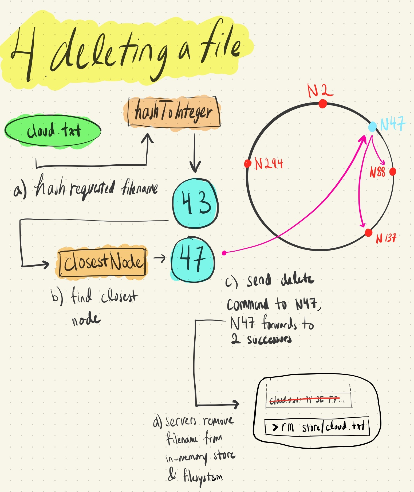

#  Chord-ish DeFiSh 
A Chord-based distributed file system that maintains state through a replicated log. Built using a bunch of other junk that I built. Explanation with graphics at the bottom!

Uses:
- [Chord-ish](https://github.com/slin63/chord-failure-detector#-chord-ish) as a membership and failure detection layer.
- [Leeky Raft](https://github.com/slin63/raft-consensus#-leeky-raft) as a consensus layer.

## Setup
#### Launching with `docker-compose`
0. Setup the network.
    - `docker network create dfs-net`
1. `docker-compose build && docker-compose up --remove-orphans --scale worker=<worker_count>`
    - Start 1 + `worker_count` nodes.
    - Recommended `worker_count ~= 5`. CPU utilization is high across all three components so expect some sluggishness.
2. Build & run client with
    - `docker build --tag client . -f ./dockerfiles/client/Dockerfile; docker run --rm -it --network="dfs-net" client /bin/sh -c ./dfs`
    - `> put go.mod remote`.
    - `> get remote local`.
    -  Available client commands listed below in _Client Commands_.

#### Configuration
`config.` files for each component can be found inside `/config`. Mappings are as follows:
- `config.dfs.json`: _Distributed File System Layer_
- `config.fd.json`: _Membership/Failure Detection Layer_
- `config.raft.json`: _Consensus Layer_

## Useage
#### Client Commands
1. `put localfilename sdfsfilename` (from local dir)
    - `put` both inserts _and_ updates a file
2. `get sdfsfilename localfilename` (fetches to local dir)
3. `delete sdfsfilename`
4. `ls filename` (list all machines where this data is stored)
5. `store` (list all files stored on this machine)

## In a Nutshell

Chord-ish DeFiSh works by assigning nodes / servers in a network onto some "virtual ring", giving them a distinct ID number as a function of their IP address.

Files are given a distinct ID number as well, as a function of their filename. The function to give ID numbers is the same for both files and nodes.

A file is stored at the first node with an ID greater than or equal to its own.

Files are replicated to the 2 nodes directly "ahead" of the aforementioned node. Files are stored as actual files each nodes' filesystem, and as `filename:sha1(file data)` maps in the runtime memory of each Chordish DeFiSh process, as a fast way to check for file ownership & save time by ignoring write requests for a file it already has.

The visuals below will explain how this all comes together.

